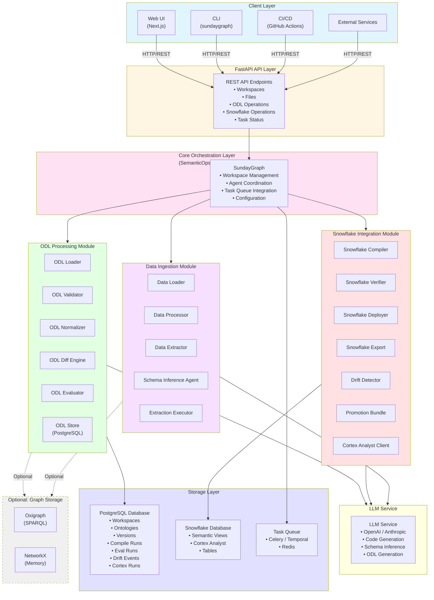

# SemanticOps for Snowflake

**SemanticOps for Snowflake Semantic Views + Cortex Analyst reliability**

A production-grade system for building, validating, and deploying Snowflake semantic views with Cortex Analyst regression testing. Transform your data into Snowflake semantic models using LLM-powered ontology definition, then ensure reliability with automated Cortex Analyst validation.

## What is SemanticOps?

SemanticOps automates the lifecycle of Snowflake semantic views:
1. **Define** your domain using Ontology Definition Language (ODL)
2. **Compile** ODL to Snowflake semantic model YAML
3. **Verify** semantic models with `SYSTEM$CREATE_SEMANTIC_VIEW_FROM_YAML(..., verify_only=>TRUE)`
4. **Deploy** validated semantic views to Snowflake
5. **Test** with Cortex Analyst regression tests to ensure reliability

## Features

- **LLM-Powered ODL Generation**: Automatically generates Ontology Definition Language from domain descriptions or data samples
- **Snowflake Semantic Model Compilation**: Converts ODL to Snowflake semantic model YAML format
- **Pre-Deployment Verification**: Validates semantic models using Snowflake's `SYSTEM$CREATE_SEMANTIC_VIEW_FROM_YAML` with `verify_only=>TRUE`
- **Cortex Analyst Regression Testing**: Automated tests to ensure semantic views work correctly with Cortex Analyst
- **CodeAct-Style Extraction**: LLM generates Python code once per file type, then executes on all rows (99%+ cost reduction)
- **Intelligent Schema Inference**: Analyzes data samples to generate extraction rules, avoiding per-row LLM calls
- **Task Queue Support**: Async processing with Celery or Temporal for scalable, reliable operations
- **PostgreSQL Schema Storage**: Stores ontology schema metadata in PostgreSQL for versioning and evolution tracking
- **Workspace-Based Multi-Tenancy**: Isolated data and semantic models per workspace
- **File Management**: Upload, preview, and manage files within workspaces (CSV, JSON, PDF, text)
- **LLM Cost Optimization**: Response caching, smart model selection, and token tracking
- **Production-Ready**: Configurable, maintainable, and scalable design

### Optional Features

- **Graph Storage** (Optional): In-memory/NetworkX or Oxigraph SPARQL database for graph exploration (not required for Snowflake semantic views)
- **Graph Visualization**: View workspace-specific graph nodes and edges (optional, for exploration)

## Quick Start

### Prerequisites

- Python 3.10+
- Snowflake account with Cortex Analyst enabled
- Snowflake connection credentials
- OpenAI API key (for LLM-powered ODL generation)

### Installation

```bash
# Clone repository
git clone <repository-url>
cd sundaygraph

# Create virtual environment (recommended)
python -m venv venv
source venv/bin/activate  # On Windows: venv\Scripts\activate

# Install dependencies
pip install -e ".[dev]"

# Copy environment variables template
cp .env.example .env
# Edit .env with your configuration

# Run database migrations
python migrations/run_migrations.py
```

### Configuration

1. **Set Environment Variables**:

   Copy `.env.example` to `.env` and configure:
   ```bash
   cp .env.example .env
   # Edit .env with your settings:
   # - OPENAI_API_KEY (required for ODL generation)
   # - DATABASE_URL (for PostgreSQL)
   # - SNOWFLAKE_* (optional, for semantic views)
   ```

2. **Configure Application** (optional):

   Edit `config/config.yaml` for advanced settings:
   - Graph backend (memory/oxigraph)
   - LLM provider and model
   - Task queue configuration

### Quickstart: Create and Deploy Snowflake Semantic View

#### Step 1: Create ODL (Ontology Definition Language)

Create an ODL file defining your domain:

```yaml
# my_domain.odl
entities:
  - name: Customer
    properties:
      - name: customer_id
        type: string
        primary_key: true
      - name: name
        type: string
      - name: email
        type: string
      - name: created_at
        type: timestamp
  
  - name: Order
    properties:
      - name: order_id
        type: string
        primary_key: true
      - name: customer_id
        type: string
        foreign_key: Customer.customer_id
      - name: total_amount
        type: decimal
      - name: order_date
        type: date

relations:
  - name: placed_by
    source: Order
    target: Customer
    properties:
      - name: order_date
        type: date
```

Or use LLM to generate ODL from domain description:

```bash
curl -X POST "http://localhost:8000/api/v1/odl/generate" \
  -H "Content-Type: application/json" \
  -d '{
    "domain_description": "E-commerce system with customers, orders, and products"
  }'
```

#### Step 2: Compile to Snowflake Semantic Model YAML

Compile ODL to Snowflake semantic model format:

```bash
curl -X POST "http://localhost:8000/api/v1/snowflake/compile" \
  -H "Content-Type: application/json" \
  -d '{
    "odl_file": "my_domain.odl",
    "workspace_id": "standard"
  }'
```

Response:
```json
{
  "semantic_model_yaml": "...",
  "entities": ["Customer", "Order"],
  "relations": ["placed_by"]
}
```

#### Step 3: Verify with Snowflake

Verify the semantic model using Snowflake's verification function:

```bash
curl -X POST "http://localhost:8000/api/v1/snowflake/verify" \
  -H "Content-Type: application/json" \
  -d '{
    "semantic_model_yaml": "...",
    "workspace_id": "standard"
  }'
```

This calls:
```sql
SELECT SYSTEM$CREATE_SEMANTIC_VIEW_FROM_YAML(
  'your_semantic_view',
  '<semantic_model_yaml>',
  verify_only => TRUE
);
```

Response:
```json
{
  "verified": true,
  "errors": [],
  "warnings": []
}
```

#### Step 4: Deploy to Snowflake

Deploy the verified semantic view:

```bash
curl -X POST "http://localhost:8000/api/v1/snowflake/deploy" \
  -H "Content-Type: application/json" \
  -d '{
    "semantic_model_yaml": "...",
    "view_name": "my_semantic_view",
    "workspace_id": "standard"
  }'
```

This creates the semantic view in Snowflake:
```sql
SELECT SYSTEM$CREATE_SEMANTIC_VIEW_FROM_YAML(
  'my_semantic_view',
  '<semantic_model_yaml>'
);
```

#### Step 5: Run Cortex Analyst Regression Tests

Test the semantic view with Cortex Analyst:

```bash
curl -X POST "http://localhost:8000/api/v1/snowflake/test-cortex" \
  -H "Content-Type: application/json" \
  -d '{
    "view_name": "my_semantic_view",
    "test_queries": [
      "What are the top 10 customers by order value?",
      "Show me customers who haven't placed orders in the last 30 days"
    ],
    "workspace_id": "standard"
  }'
```

Response:
```json
{
  "tests_passed": 2,
  "tests_failed": 0,
  "results": [
    {
      "query": "What are the top 10 customers by order value?",
      "status": "passed",
      "response": "...",
      "latency_ms": 1234
    }
  ]
}
```

### Complete Workflow Example

```bash
# 1. Generate ODL from domain description
ODL=$(curl -X POST "http://localhost:8000/api/v1/odl/generate" \
  -H "Content-Type: application/json" \
  -d '{"domain_description": "E-commerce with customers and orders"}' \
  | jq -r '.odl')

# 2. Compile to Snowflake semantic model
YAML=$(curl -X POST "http://localhost:8000/api/v1/snowflake/compile" \
  -H "Content-Type: application/json" \
  -d "{\"odl\": \"$ODL\"}" \
  | jq -r '.semantic_model_yaml')

# 3. Verify
VERIFY_RESULT=$(curl -X POST "http://localhost:8000/api/v1/snowflake/verify" \
  -H "Content-Type: application/json" \
  -d "{\"semantic_model_yaml\": \"$YAML\"}")

if [ "$(echo $VERIFY_RESULT | jq -r '.verified')" == "true" ]; then
  # 4. Deploy
  curl -X POST "http://localhost:8000/api/v1/snowflake/deploy" \
    -H "Content-Type: application/json" \
    -d "{\"semantic_model_yaml\": \"$YAML\", \"view_name\": \"ecommerce_semantic\"}"
  
  # 5. Test with Cortex Analyst
  curl -X POST "http://localhost:8000/api/v1/snowflake/test-cortex" \
    -H "Content-Type: application/json" \
    -d '{"view_name": "ecommerce_semantic", "test_queries": ["List all customers"]}'
fi
```

## Architecture

### System Architecture Diagram



### Complete Workflow Diagram: ODL → Snowflake Semantic View

```mermaid
flowchart TD
    Start([Input Sources<br/>• Domain Description<br/>• Data Files<br/>• Existing ODL])
    
    Step1[STEP 1: ODL Generation & Validation<br/>ODL Generator Agent<br/>• Analyze domain/data samples<br/>• Use LLM to generate ODL JSON<br/>• Validate against ODL Schema<br/>• Normalize to ODL IR<br/>• Store in PostgreSQL]
    
    Step2[STEP 2: ODL Evaluation & Diff Analysis<br/>ODL Evaluator<br/>• Structural gates<br/>• Semantic gates<br/>• Deployability gates<br/>• Threshold profiles<br/><br/>ODL Diff Engine<br/>• Compare versions<br/>• Detect breaking changes<br/>• Detect non-breaking changes<br/>• Store diff in database]
    
    Step3[STEP 3: Snowflake Compilation<br/>Snowflake Compiler<br/>• Parse ODL IR<br/>• Map objects → logical tables<br/>• Map relationships → join paths<br/>• Map metrics → facts/metrics<br/>• Map dimensions → dimensions<br/>• Generate semantic_model.yaml<br/>• Generate verify.sql<br/>• Generate deploy.sql<br/>• Generate rollback.sql<br/>• Create ArtifactBundle<br/>• Store compile_run]
    
    Step4[STEP 4: Snowflake Verification<br/>Snowflake Verifier<br/>• Connect to Snowflake<br/>• Execute verify.sql<br/>• CALL SYSTEM$CREATE_SEMANTIC_VIEW_FROM_YAML<br/>  with verify_only => TRUE<br/>• Check errors/warnings<br/>• Return verification results]
    
    Step5[STEP 5: Deployment<br/>Snowflake Deployer<br/>• Export current view YAML for rollback<br/>• Execute deploy.sql<br/>• CALL SYSTEM$CREATE_SEMANTIC_VIEW_FROM_YAML<br/>  with verify_only => FALSE<br/>• Create semantic view<br/>• Store deployment metadata]
    
    Step6[STEP 6: Cortex Analyst Regression Testing<br/>Cortex Analyst Regression Runner<br/>• Load golden_questions.yaml<br/>• For each question:<br/>  - Call Cortex Analyst REST API<br/>  - Validate SQL patterns<br/>  - Validate answer snippets<br/>  - Measure latency<br/>• Store results in database<br/>• Generate junit.xml<br/>• Return pass/fail status]
    
    Step7[STEP 7: Drift Detection<br/>Continuous Monitoring<br/>Drift Detector<br/>• Mapping Drift:<br/>  - Compare ODL vs information_schema<br/>  - Detect column renames/drops/adds<br/>• Semantic View Drift:<br/>  - Compare generated vs live YAML<br/>  - Detect manual edits<br/>  - Detect divergence<br/>• Create drift_event records<br/>• Alert on breaking changes]
    
    Start --> Step1
    Step1 --> Step2
    Step2 --> Step3
    Step3 --> Step4
    Step4 -->|Verified| Step5
    Step4 -->|Failed| Step3
    Step5 --> Step6
    Step6 --> Step7
    Step7 -.->|Continuous| Step7
    
    style Start fill:#e1f5ff
    style Step1 fill:#e1ffe1
    style Step2 fill:#fff4e1
    style Step3 fill:#ffe1f5
    style Step4 fill:#ffffe1
    style Step5 fill:#e1e1ff
    style Step6 fill:#ffe1e1
    style Step7 fill:#f0f0f0
```



### Data Flow Diagram

```mermaid
flowchart TB
    subgraph InputDataFlow["Input Data Flow"]
        CSV[CSV Files]
        JSON[JSON Files]
        PDF[PDF Files]
        Text[Text Files]
        
        DataLoader[Data Loader<br/>Multi-format]
        SchemaInf[Schema Inference Agent<br/>CodeAct Approach<br/>• Analyze sample<br/>• Generate code]
        ExtractionExec[Extraction Executor<br/>• Execute code<br/>• Extract entities<br/>• Extract relations]
        ODLGen[ODL Generator<br/>• Build ontology<br/>• Generate ODL JSON]
        PGStore1[PostgreSQL Store<br/>• ontology_version<br/>• ODL JSON payload]
        
        CSV --> DataLoader
        JSON --> DataLoader
        PDF --> DataLoader
        Text --> DataLoader
        DataLoader --> SchemaInf
        SchemaInf --> ExtractionExec
        ExtractionExec --> ODLGen
        ODLGen --> PGStore1
    end
    
    subgraph ODLProcessingFlow["ODL Processing Flow"]
        ODLFile[ODL JSON File<br/>User-provided]
        ODLLoad[ODL Loader<br/>• Load JSON]
        ODLVal[ODL Validator<br/>• Schema validation<br/>• Business rules]
        ODLNorm[ODL Normalizer<br/>• Sort lists<br/>• Canonical names]
        ODLIR[ODL IR<br/>Stable format]
        SnowflakeComp[Snowflake Compiler<br/>• ODL IR → YAML<br/>• Generate SQL files]
        ArtifactBundle[ArtifactBundle<br/>• semantic_model.yaml<br/>• verify.sql<br/>• deploy.sql<br/>• rollback.sql]
        SnowflakeDB[Snowflake Database<br/>• Semantic View]
        
        ODLFile --> ODLLoad
        ODLLoad --> ODLVal
        ODLLoad --> ODLNorm
        ODLVal --> ODLIR
        ODLNorm --> ODLIR
        ODLIR --> SnowflakeComp
        SnowflakeComp --> ArtifactBundle
        ArtifactBundle --> SnowflakeDB
    end
    
    subgraph TaskQueueFlow["Task Queue Flow (Async Processing)"]
        APIReq[API Request<br/>Long-running]
        TaskQueue[Task Queue<br/>Celery/Temporal<br/>• Enqueue task<br/>• Return task_id]
        Worker[Worker Process<br/>• Process ODL<br/>• Compile<br/>• Deploy]
        TaskStatus[Task Status API<br/>• PENDING<br/>• IN_PROGRESS<br/>• COMPLETED<br/>• FAILED]
        
        APIReq --> TaskQueue
        TaskQueue --> Worker
        Worker --> TaskStatus
    end
    
    style InputDataFlow fill:#e1f5ff
    style ODLProcessingFlow fill:#e1ffe1
    style TaskQueueFlow fill:#fff4e1
```



## API Usage

### Interactive API Documentation

Visit http://localhost:8000/docs for interactive API documentation.

### ODL Generation

```bash
# Generate ODL from domain description
curl -X POST "http://localhost:8000/api/v1/odl/generate" \
  -H "Content-Type: application/json" \
  -d '{
    "domain_description": "E-commerce system with customers, orders, products, and payments"
  }'

# Generate ODL from data files
curl -X POST "http://localhost:8000/api/v1/workspaces/standard/build-ontology?username=admin" \
  -H "Content-Type: application/json" \
  -d '{
    "filenames": ["customers.csv", "orders.csv"]
  }'
```

### Snowflake Operations

```bash
# Compile ODL to Snowflake semantic model YAML
curl -X POST "http://localhost:8000/api/v1/snowflake/compile" \
  -H "Content-Type: application/json" \
  -d '{
    "odl_file": "my_domain.odl",
    "workspace_id": "standard"
  }'

# Verify semantic model
curl -X POST "http://localhost:8000/api/v1/snowflake/verify" \
  -H "Content-Type: application/json" \
  -d '{
    "semantic_model_yaml": "...",
    "workspace_id": "standard"
  }'

# Deploy semantic view
curl -X POST "http://localhost:8000/api/v1/snowflake/deploy" \
  -H "Content-Type: application/json" \
  -d '{
    "semantic_model_yaml": "...",
    "view_name": "my_semantic_view",
    "workspace_id": "standard"
  }'

# Test with Cortex Analyst
curl -X POST "http://localhost:8000/api/v1/snowflake/test-cortex" \
  -H "Content-Type: application/json" \
  -d '{
    "view_name": "my_semantic_view",
    "test_queries": [
      "What are the top customers?",
      "Show me recent orders"
    ],
    "workspace_id": "standard"
  }'
```

## Optional: Graph Storage

Graph storage (Oxigraph/NetworkX) is **optional** and not required for Snowflake semantic views. It can be used for:

- **Exploration**: Visualizing relationships before deploying to Snowflake
- **Development**: Testing ontology schemas locally
- **Analysis**: Graph-based queries and path finding

To enable graph storage:

```yaml
# config/config.yaml
graph:
  backend: "oxigraph"  # or "memory" for in-memory
  oxigraph:
    sparql_endpoint: "http://oxigraph:7878/query"
    update_endpoint: "http://oxigraph:7878/update"
```

**Note**: Graph storage is not part of the Quickstart and is not required for Snowflake semantic view deployment.

## Project Structure

```
sundaygraph/
├── src/
│   ├── api/                      # FastAPI REST API
│   ├── agents/                   # Agentic components
│   │   ├── odl_generator_agent.py    # ODL generation
│   │   ├── snowflake_compiler_agent.py  # Snowflake compilation
│   │   ├── snowflake_verifier_agent.py  # Semantic model verification
│   │   ├── snowflake_deployer_agent.py  # Deployment
│   │   └── cortex_analyst_tester_agent.py  # Cortex Analyst testing
│   ├── core/                     # Core orchestration
│   ├── data/                     # Data processing
│   ├── graph/                     # Graph storage (OPTIONAL)
│   ├── ontology/                  # Ontology management
│   ├── snowflake/                 # Snowflake integration
│   │   ├── connection.py          # Snowflake connection
│   │   ├── compiler.py            # ODL → YAML compiler
│   │   ├── verifier.py             # Semantic model verification
│   │   └── deployer.py             # Semantic view deployment
│   ├── storage/                   # PostgreSQL schema storage
│   ├── tasks/                     # Task queue (async processing)
│   └── utils/                     # Utilities
├── config/
│   └── config.yaml                # Main configuration
└── README.md                       # This file
```

## Development

### Running Locally

```bash
# Start API server
python run_local.py
# Or: python -m uvicorn src.api.main:app --reload --host 0.0.0.0 --port 8000
```

### Running Tests

```bash
uv run pytest
```

## License

MIT License
